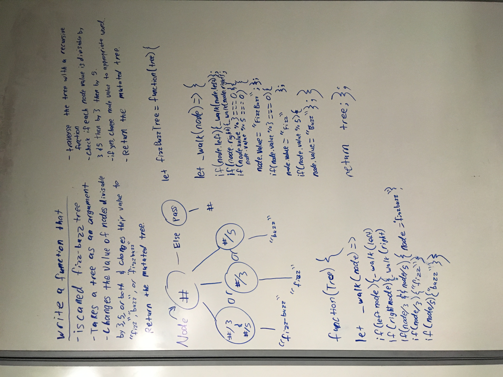

# Challenge Summary
we are writing a function that takes in a tree, and alters the values divisible by 3, 5 or both with fizz, buzz, and fizzbuzz respectively, then returning the altered tree.

## Challenge Description
Write a function called `fizzBuzzTree` that takes in a tree and returns a tree with updated values based on the following:
* if the node value is divisible by 3 it will update to "fizz"
* if the node value is divisible by 5 it will update to "buzz"
* if the node value is divisible by 3 AND 5 it will update to "fizzbuzz"

## Approach & Efficiency
Traverse the tree using a recursive function, checking each node's value with and if statement--whether divisible by both 3 and 5, only 3 or only 5. Should the condition be met the node value will be changed to the appropriate word. Once all nodes have been checked and udated, the tree will be returned, effectively mutated by the updates.

## Solution

