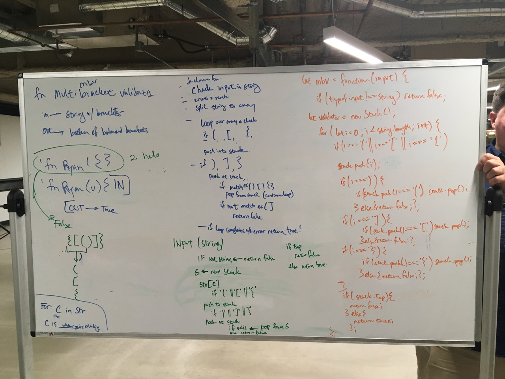

# Challenge Summary
we are writing a function to ensure that any bracket or parenthesis alwways has its mate.

## Challenge Description
Write a function called `multiBracketValidation` that takes in a string and returns a boolean telling whether or not any brackets in the string are balanced. It needs to be able to take:
* Round Brackets : ()
* Square Brackets : []
* Curly Brackets : {}

## Approach & Efficiency
<!-- What approach did you take? Why? What is the Big O space/time for this approach? -->

stuff to look out for:

Input	Output
{}	TRUE
{}(){}	TRUE
()[[Extra Characters]]	TRUE
(){}[[]]	TRUE
{}{Code}[Fellows](())	TRUE
[({}]	FALSE
(](	FALSE
{(})	FALSE
Consider these small examples and why they fail.

Input	Output	Why
{	FALSE	error unmatched opening { remaining.
)	FALSE	error closing ) arrived without corresponding opening.
[}	FALSE	error closing }. Doesn’t match opening.

## Solution

