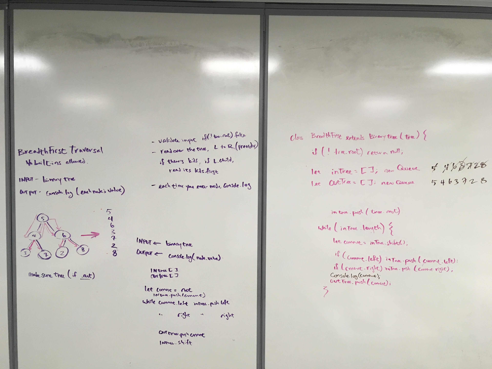
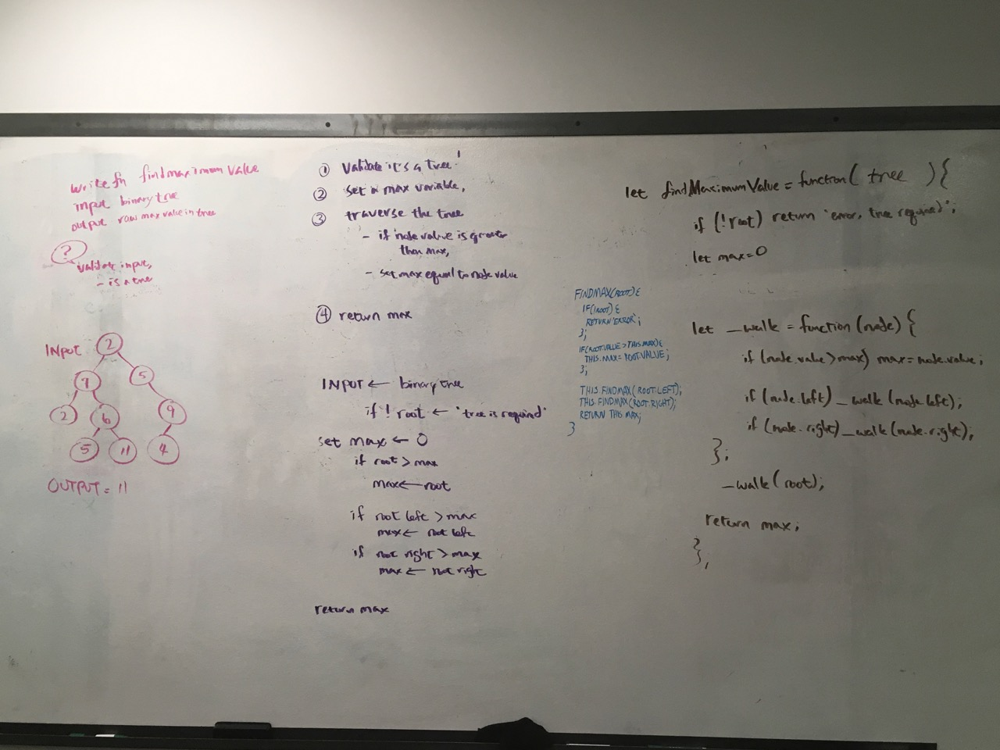

# Trees
<!-- Short summary or background information -->

# DEPTH-FIRST Traversal Methods:
## `inOrder`, `preOrder`, `postOrder`

## Challenge
<!-- Description of the challenge -->

## Approach & Efficiency
<!-- What approach did you take? Why? What is the Big O space/time for this approach? -->

## UML
<!-- Description of each method publicly available in each of your trees -->

# BREADTH-FIRST Traversal
Write a breath-first traversal method to extend our binaryTree class. 

## Challenge Description
Without utilizing any built-in methods, traverse the tree breadth-first and console.log each node's value.

## Approach & Efficiency
To record the tree's nodes in the specified order we drew inspiration from the levelOrder method of traversing a tree, where you start from the root and walk left node, then right node; rinse, repeat. So if you have a root of 5 whose left is 4 and right is 6... now we are going to get hairy... 4's got kids named 3 and 7; and 6 has kids named 2 and 8, our traversal would go in this order: 5, 4, 6, 3, 7, 2, 8. (see the UML)

As we traverse the tree, since we aren't being required to remember or return any physical output, we are going to run a console log at each node we hit, upon arrival.

Since we are traveling the tree from the root, across for as long as the height, this lookup would have an efficiency of `O(hw)`. It will take as long as the tree is high/deep AND wide.

## Solution
Our method takes in a tree and begins at the root. from the root it will first look left, then right, and reassign the `current` value based on the queue order. WE will loop through until our inTree queue is empty.

## UML*

**subout the `shift` for a `dequeue`, and the `push` for  `enqueue`.* 

# Find The MAX!:
## Challenge
We need to find the maximum valued node in our tree and return it! So, create a function whose input is a binary tree and output is the node with the greatest value.

## Approach & Efficiency
For this, we know we are going to need to traverse the entire tree in order to check all of the nodes to make sure that we've seen them all. 

Create a temporary variable called max, that will store the max number--we can start at 0, but this will have big problems if the entire tree is negative numbers ☹️

## UML
